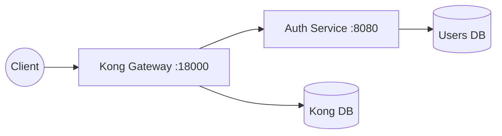

# Architecture and Execution Flow

This document explains how the API Gateway and `auth-service` interact,
including the execution path a request takes.

## High-Level Architecture

The `auth-service` is heavily decoupled. It has its own isolated database
(`users-db`) and does not share state with the API Gateway configuration
database (`kong-database`).

## Boot Sequence: Who Calls Whom?

1. **Docker Compose (`docker-compose.yml`)**
   Starts the infrastructure. It spins up Postgres containers
   (`kong-database` and `users-db`), runs `kong-migrations` to initialize
   Kong's schema, and starts `kong` and `auth-service`.

2. **Gateway Configuration (`kong/setup-core.sh`)**
   This script runs on the host machine. It executes `curl` commands against
   Kong's Admin API on `:8001`. It creates a global consumer
   (`springboot-auth`) and defines the JWT secret so Kong can verify tokens
   issued by the backend.

3. **Plug Kit Configuration (`auth-service/plug/kong-setup.sh`)**
   The core setup script delegates to the auth plug kit. The plug kit creates
   the `auth-service` upstream pointing to `http://auth-service:8080`, creates
   the `/auth` route, and applies rate limiting to this service.

## Request Execution Flow: `/auth/login`

1. **Client to Kong**
   The client executes `POST http://localhost:18000/auth/login`.

2. **Kong Router**
   Kong receives the request on port `18000`, checks its in-memory routing
   table synced from `kong-database`, and matches `/auth` to `auth-route`.

3. **Kong Plugins**
   Kong evaluates the `rate-limiting` plugin. If the client exceeds
   `10 req/min`, Kong returns `429 Too Many Requests`; otherwise it proceeds.

4. **Kong to Upstream**
   Kong proxies the HTTP request through the Docker network to
   `http://auth-service:8080/auth/login`.

5. **Spring Boot Dispatcher**
   Embedded Tomcat receives the request. Spring's `DispatcherServlet` maps it
   to `AuthController.java` based on `@PostMapping("/login")`.

6. **Controller Logic**
   `AuthController` parses the JSON payload, calls
   `UserRepository.findByUsername()`, verifies the BCrypt password, and calls
   `JwtService.issueToken()` to mint an HS256 JWT.

7. **Response**
   The controller returns a `200 OK` JSON response containing the token. Kong
   relays the response back to the client and attaches rate-limit headers.
