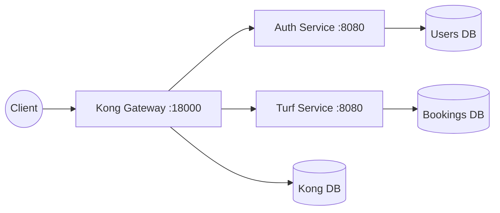
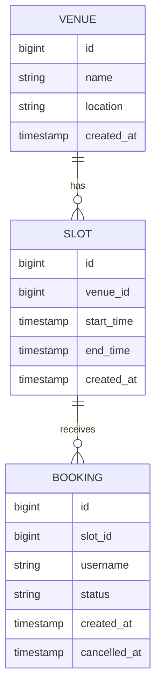
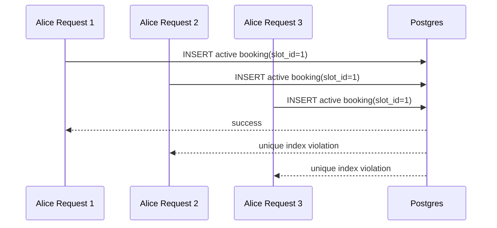

# Architecture and Execution Flow

This document explains how Kong, `auth-service`, and `turf-service` interact,
including the exact request flow for browsing venues, booking slots, preventing
double-booking, listing a user's bookings, and cancelling a booking.

## High-Level Architecture



The `turf-service` is independent from auth. It does not own users,
passwords, sessions, or token signing. It stores the username copied from the
JWT `sub` claim as the owner of a booking.

## Service Boundary

The turf service owns:

- venue records
- time slot records
- booking records
- active/cancelled booking state
- the database-level no-double-booking guarantee

It does not own:

- user registration or login
- password hashing
- JWT signing
- edge JWT verification
- payment
- search/ranking
- notifications
- chat with venue owners

This boundary keeps the service reusable. Any host project that already has
Kong and the auth plug kit can mount turf by using `turf-service/plug`.

## Boot Sequence: Who Calls Whom?

1. **Docker Compose (`docker-compose.yml`)**
   The `turf` profile starts Kong, Kong's Postgres database, `auth-service`,
   `users-db`, `turf-service`, and `bookings-db`.

2. **Core Gateway Configuration (`kong/setup-core.sh`)**
   This registers `/auth`, creates the Kong consumer `springboot-auth`, and
   attaches the HS256 JWT credential that matches tokens issued by
   `auth-service`.

3. **Turf Plug Kit Configuration (`turf-service/plug/kong-setup.sh`)**
   This creates the `turf-service` upstream, registers the `/bookings` route,
   attaches Kong's `jwt` plugin, and applies rate limiting.

4. **Spring Boot Startup**
   `TurfApplication` starts embedded Tomcat. Spring Data JPA creates or updates
   the `venues`, `slots`, and `bookings` tables in `bookings-db`.

5. **Data Initializer**
   `TurfDataInitializer` creates the partial unique index that enforces one
   active booking per slot. Then it seeds venues and future slots if the
   `venues` table is empty.

## Data Model



Important indexes:

- `slots(venue_id, start_time)` supports venue slot listing.
- `slots(start_time)` supports future-slot queries and operational filtering.
- `bookings(username)` supports `/bookings/mine`.
- `bookings(slot_id, status)` supports availability checks.
- `bookings(slot_id) WHERE status = 'active'` prevents double-booking.

The last index is the central design decision. It allows many historical
cancelled bookings for a slot, but only one active booking.

## Why The Partial Unique Index Matters

The core invariant is:

```text
For a given slot_id, at most one booking may have status = 'active'.
```

This is implemented in Postgres:

```sql
CREATE UNIQUE INDEX IF NOT EXISTS uk_bookings_active_slot
ON bookings (slot_id)
WHERE status = 'active'
```

This guarantee belongs in the database because application checks can race:

1. Alice checks whether the slot is available.
2. Bob checks whether the same slot is available.
3. Both see no active booking.
4. Both insert.

If availability is protected only by application code, both inserts can
succeed under concurrency. With the partial unique index, Postgres accepts one
insert and rejects the other. The service maps that rejection to `409 Conflict`.

## Request Flow: `GET /bookings/venues`

1. **Client to Kong**
   The client sends:

   ```text
   GET http://localhost:18000/bookings/venues
   Authorization: Bearer <token>
   ```

2. **Kong Router**
   Kong matches `/bookings` to `turf-route`, which points to `turf-service`.

3. **Kong JWT Plugin**
   Kong validates the token signature and expiration. If the token is missing,
   invalid, or expired, Kong returns `401` before Java handles the request.

4. **Kong Rate Limiting**
   Kong applies the turf service rate limit. If the caller exceeds the limit,
   Kong returns `429 Too Many Requests`.

5. **Kong to Upstream**
   Kong proxies the request to:

   ```text
   http://turf-service:8080/bookings/venues
   ```

6. **Spring MVC Controller**
   `BookingController.venues()` receives the request. It uses `JwtHelper` to
   extract the JWT subject. The username is not needed for filtering venues,
   but decoding it confirms the downstream identity path is present.

7. **Business Logic**
   `BookingService.listVenues()`:

   - loads venues ordered by name and ID
   - loads all slots for those venues ordered by start time and ID
   - loads active bookings for those slot IDs
   - marks each slot `available` when its ID is not actively booked

8. **Response**
   The response is `200 OK` with venue records and nested slot availability.

## Request Flow: `POST /bookings`

1. **Client to Kong**
   The client sends:

   ```http
   POST /bookings
   Authorization: Bearer <token>
   Content-Type: application/json

   {"slotId": 1}
   ```

2. **Kong JWT Plugin**
   Kong verifies the token. Missing or invalid tokens get `401`.

3. **Controller**
   `BookingController.book()` extracts the username from the JWT `sub` claim
   and reads `slotId` from the JSON body.

4. **Transaction Begins**
   `BookingService.book()` runs inside `@Transactional`.

5. **Validation**
   The service checks:

   - username is present
   - `slotId` is present
   - the slot exists
   - the slot start time is still in the future

6. **Insert The Active Booking**
   The service calls:

   ```java
   bookings.saveAndFlush(new Booking(slot.getId(), currentUser));
   ```

   `saveAndFlush` is intentional. It forces the database insert before the
   method returns, so a unique-index violation is raised inside this method and
   can be mapped to `409 Conflict`.

7. **Database Enforces The Invariant**
   If no active booking exists for the slot, Postgres accepts the insert. If
   another transaction already inserted an active booking, the partial unique
   index rejects this insert.

8. **Conflict Mapping**
   Spring wraps the database error as `DataIntegrityViolationException`.
   `BookingService` catches it and throws `ConflictException("slot already booked")`.
   The controller maps that to:

   ```text
   409 Conflict
   ```

9. **Success Response**
   On success, the controller returns `201 Created` with a `BookingView`.

## Request Flow: `GET /bookings/mine`

1. Kong verifies the JWT.
2. `BookingController.mine()` extracts the current username from token `sub`.
3. `BookingService.mine(username)` queries:

   ```java
   findByUsernameOrderByCreatedAtDescIdDesc(username)
   ```

4. The service enriches each booking with slot and venue information.
5. The response returns only bookings owned by the current token subject.

There is no `?username=` query parameter. The identity source is the JWT.

## Request Flow: `DELETE /bookings/{id}`

1. Kong verifies the JWT.
2. `BookingController.cancel()` extracts the current username.
3. `BookingService.cancel(username, id)` loads the booking.
4. If the booking does not exist, the service returns `404`.
5. If the booking belongs to another username, the service returns `403`.
6. If the booking is active, `booking.cancel()` changes:

   ```text
   status = cancelled
   cancelled_at = now
   ```

7. If the booking is already cancelled, `booking.cancel()` is a no-op.
8. The controller returns `204 No Content`.

Cancelling frees the slot because the partial unique index only applies to
rows where `status = 'active'`.

## Concurrent Booking Flow

When three clients try to book the same available slot at the same time:



The exact winner does not matter. The invariant is:

```text
success_count = 1
conflict_count = N - 1
```

The smoke script verifies this with parallel `curl` requests.

## Error Semantics

Through Kong:

- missing token -> `401`
- invalid token -> `401`
- expired token -> `401`
- rate limit exceeded -> `429`

Inside `turf-service`:

- missing `slotId` -> `400`
- slot in the past -> `400`
- nonexistent slot -> `404`
- already-booked slot -> `409`
- cancelling another user's booking -> `403`
- cancelling own booking -> `204`
- cancelling own already-cancelled booking -> `204`

If the service is called directly without Kong, `JwtHelper` can decode the JWT
payload but does not verify the signature. Signature verification is Kong's job
in this architecture.

## Plug Kit

The turf plug kit lives under:

```text
turf-service/plug/
```

It contains:

- `compose.plug.yml` - reusable service and database definitions
- `kong-setup.sh` - idempotent route/plugin registration
- `smoke.sh` - browse, book, conflict, cancel, and rebook proof

The standalone host project is:

```text
examples/turf-standalone/
```

That demo includes the auth plug kit and the turf plug kit without changing
either service's source code.

## Scaling Notes

This version is intentionally simple and correct for a single booking service:

- Postgres is the source of truth.
- The no-double-booking invariant is enforced by a unique index.
- The API is synchronous.
- There is no payment flow.
- There is no distributed lock.

The next scale step would still keep the unique index. A queue, lock, or cache
may improve user experience under extreme contention, but it should not replace
the database invariant.
