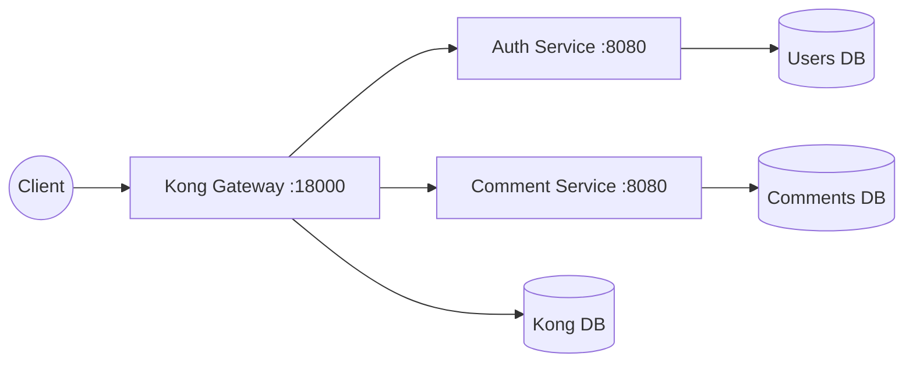
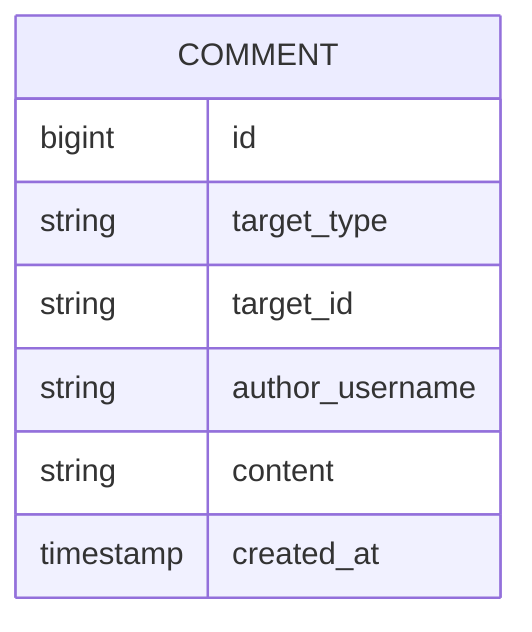

# Architecture and Execution Flow

This document explains how Kong, `auth-service`, and `comment-service`
interact, including the execution path for protected `/comments` requests.

## High-Level Architecture



The `comment-service` is intentionally reusable. It does not know whether a
comment belongs to a tweeter post, a YouTube video, a turf venue, or some
future product resource. It stores only:

- `targetType`, for example `tweeter.post` or `youtube.video`
- `targetId`, for example `123` or `video_abc`
- `authorUsername`, read from the JWT `sub` claim
- comment content and server timestamp

## Service Boundary

The comment service owns:

- comment rows
- target-scoped comment pagination
- owner-only comment deletion
- target key validation

It does not own:

- passwords, sessions, or user profiles
- target resources such as posts or videos
- target existence validation
- replies, reactions, moderation, or live comment broadcast

This boundary lets any Kong-fronted product mount comments by agreeing on a
stable target key convention.

## Boot Sequence: Who Calls Whom?

1. **Docker Compose (`docker-compose.yml`)**
   The `comments` profile starts Kong, Kong's Postgres database,
   `auth-service`, `users-db`, `comment-service`, and `comments-db`.

2. **Core Gateway Configuration (`kong/setup-core.sh`)**
   This registers `/auth`, creates the Kong consumer `springboot-auth`, and
   attaches or updates the HS256 JWT credential that matches tokens issued by
   `auth-service`.

3. **Comment Plug Kit Configuration (`comment-service/plug/kong-setup.sh`)**
   This creates the `comment-service` upstream, registers the `/comments`
   route, attaches Kong's `jwt` plugin, and applies rate limiting.

4. **Smoke Test (`comment-service/plug/smoke.sh`)**
   This runs a generic target flow through Kong: register, login, create
   comments on two unrelated targets, page one target, verify isolation,
   reject non-owner delete, and allow owner delete.

## Data Model



Important indexes:

- `(target_type, target_id, created_at DESC, id DESC)` supports target comment
  reads and cursor paging.
- `(author_username, created_at DESC, id DESC)` supports future author-centric
  tools or moderation flows.

## Request Execution Flow: `POST /comments/targets/{targetType}/{targetId}`

1. **Client to Kong**
   The client sends a request to:

   ```text
   POST http://localhost:18000/comments/targets/tweeter.post/123
   Authorization: Bearer <token>
   Content-Type: application/json
   ```

   Body:

   ```json
   {
     "content": "Nice post"
   }
   ```

2. **Kong Router**
   Kong matches `/comments` to `comment-route`, which points to
   `comment-service`.

3. **Kong JWT Plugin**
   Kong validates the token signature and expiration. If the token is missing,
   invalid, or expired, Kong returns `401` before the request reaches Java.

4. **Kong Rate Limiting**
   Kong checks the rate-limiting plugin and returns `429` if the caller is
   over the configured limit.

5. **Kong to Upstream**
   Kong proxies the request to `http://comment-service:8080/comments/...`.

6. **Spring MVC Controller**
   `CommentController.create()` reads the verified JWT payload using
   `JwtHelper`, extracts `sub`, and delegates to `CommentService.create()`.

7. **Business Logic**
   `CommentService.create()` validates:

   - author username is present
   - targetType starts with a letter and uses only allowed characters
   - targetId uses only allowed characters
   - content is non-empty and at most 500 characters

8. **Persistence**
   The service writes a `Comment` row in `comments-db`. It does not call the
   target service and does not check whether the target exists.

9. **Response**
   The controller returns `201 Created` with id, targetType, targetId,
   authorUsername, content, and createdAt.

## Target Comment Paging: `GET /comments/targets/{targetType}/{targetId}`

1. Kong validates the JWT at the edge.
2. `CommentController.byTarget()` extracts the username only to require an
   authenticated caller.
3. `CommentService.findByTarget()` validates the target key and clamps
   `pageSize` between the default and maximum.
4. `CommentRepository` reads comments newest-first:

   ```sql
   ORDER BY created_at DESC, id DESC
   ```

5. If a cursor is present, the repository reads rows older than the cursor:

   ```sql
   created_at < :createdAt OR (created_at = :createdAt AND id < :id)
   ```

6. The response contains `items` and `nextCursor` when more rows exist.

The cursor includes both `createdAt` and `id`, because timestamps can tie. The
pair creates a total order and prevents duplicated or skipped comments.

## Delete Flow: `DELETE /comments/{id}`

1. Kong validates the JWT.
2. `CommentController.delete()` extracts the current username from `sub`.
3. `CommentService.deleteOwn()` loads the comment.
4. Missing comment returns `404`.
5. A user deleting someone else's comment gets `403`.
6. The owner gets `204 No Content`, and the row is hard-deleted.

Hard delete is right-sized for v1 because there are no replies or moderation
audit trails yet. If nested comments arrive later, tombstones may become a
better fit.
