# System Overview — Pluggable Services Platform

Whole-system architecture. Kong sits at the edge and verifies JWTs; every service owns
its own Postgres; cross-service data flows over RabbitMQ events or workload-JWT HTTP.

```mermaid
graph TB
    Client([Client / Frontend])

    subgraph Edge["🌐 Edge"]
        Kong["Kong API Gateway<br/>:18000 proxy · :18001 admin<br/>JWT verify + rate limiting"]
        KongDB[("kong-database<br/>Postgres — gateway config")]
        Kong -.config.-> KongDB
    end

    Client -->|HTTPS + Bearer JWT| Kong

    subgraph Services["⚙️ Owning Services (Spring Boot, each own DB)"]
        Auth["auth-service<br/>/auth · issues JWT"]
        Tweeter["tweeter-service<br/>/posts · posts, follows, feed"]
        Comment["comment-service<br/>/comments · generic target comments"]
        Search["post-search-service<br/>/post-search · inverted index"]
        Media["media-service<br/>/media · Cloudinary attachments"]
        Booking["booking-service<br/>/bookings · slots (standalone)"]
        Whatsapp["whatsapp-service<br/>/chat · REST + WebSocket (standalone)"]
        Leet["leetcode-service (api)<br/>/leetcode · problems, submissions"]
        LeetWorker["leetcode-judge-worker<br/>sandboxed code execution"]
        BFF["bff<br/>API composer · client-shaped reads"]
    end

    subgraph DBs["🗄️ Per-service Postgres"]
        AuthDB[("users-db")]
        PostsDB[("posts-db")]
        CommentsDB[("comments-db")]
        SearchDB[("post-search-db")]
        MediaDB[("media-db")]
        BookingsDB[("bookings-db")]
        ChatsDB[("chats-db")]
        LeetDB[("leetcode-db")]
    end

    Auth --> AuthDB
    Tweeter --> PostsDB
    Comment --> CommentsDB
    Search --> SearchDB
    Media --> MediaDB
    Booking --> BookingsDB
    Whatsapp --> ChatsDB
    Leet --> LeetDB
    LeetWorker --> LeetDB

    Kong -->|/auth PUBLIC| Auth
    Kong -->|/posts JWT| Tweeter
    Kong -->|/comments JWT| Comment
    Kong -->|/post-search JWT| Search
    Kong -->|/media JWT| Media
    Kong -->|/bookings JWT| Booking
    Kong -->|/chat JWT| Whatsapp
    Kong -->|/leetcode JWT| Leet
    Kong -->|/bff JWT| BFF

    subgraph Platform["🔌 Platform (shared infra)"]
        MQ{{"RabbitMQ<br/>topic exchange: platform.events.v1<br/>+ DLX: platform.events.dlx"}}
        Prom["Prometheus"]
        Graf["Grafana"]
    end

    %% Async events (publish → exchange → consumer queues)
    Auth -. "user.*" .-> MQ
    Tweeter -. "post.* / follow.*" .-> MQ
    Comment -. "comment.*" .-> MQ
    Media -. "media.*" .-> MQ
    MQ -. "post.deleted" .-> Comment
    MQ -. "post.updated / post.deleted" .-> Search
    MQ -. "post.deleted" .-> Media
    Leet -. "judge.requested" .-> MQ
    MQ -. "judge.requested" .-> LeetWorker
    LeetWorker -. "judge.completed" .-> MQ
    MQ -. "judge.completed" .-> Leet

    %% Sync HTTP cross-service (workload-JWT authenticated)
    Comment ==>|"export backfill (workload JWT)"| Tweeter
    Search ==>|export backfill| Tweeter
    Media ==>|export backfill| Tweeter
    BFF ==>|read-compose| Tweeter
    BFF ==> Comment
    BFF ==> Media

    Media -->|upload| Cloud([Cloudinary CDN])
    Services -.metrics.-> Prom
    Prom --> Graf
```

**Legend:** solid `-->` = sync HTTP through Kong · double `==>` = internal sync HTTP (workload-JWT) · dotted `-.->` = async event over RabbitMQ.

## Key architectural principles

- **Edge auth:** Kong verifies JWT at the edge; `auth-service` mints tokens and its routes are public. Other services trust the verified JWT.
- **Database-per-service:** no shared DB — each service owns its Postgres. Cross-service data flows via events or authenticated HTTP export, never shared tables.
- **Event backbone:** one topic exchange `platform.events.v1` with per-consumer work queues, retry, and a dead-letter exchange (`platform.events.dlx`).
- **Workload identity:** internal service-to-service HTTP (export backfill, BFF) is authenticated with a separate **workload JWT**, distinct from user JWTs.
- **Standalone services:** `booking-service` and `whatsapp-service` use JWT + own DB only (no event bus); whatsapp adds WebSocket delivery.
- **Async worker pattern:** leetcode splits into an API + a sandboxed judge worker communicating over RabbitMQ.
