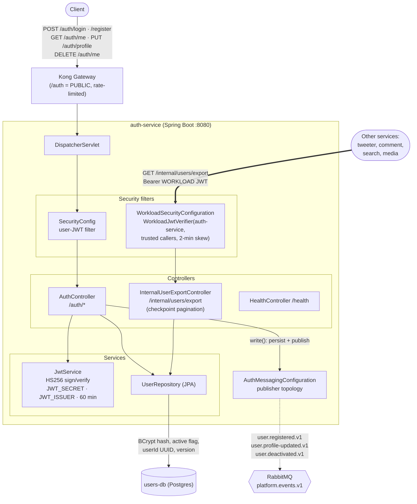

# auth-service — Architecture

Owns the `/auth` prefix and the **user identity + JWT minting** responsibility. Its routes
are *public* at Kong (it is the thing that issues tokens); every other service trusts the
JWTs it signs. Owns `users-db` exclusively.

## Component / request flow

## Domain model — `User`

| Field | Notes |
|-------|-------|
| `id` (Long) | primary key |
| `userId` (UUID) | stable public identity, immutable — used in JWT subject & events |
| `username` | unique |
| `passwordHash` | BCrypt |
| `active` (boolean) | soft-deactivate flag |
| `version` (long) | optimistic locking |

## Responsibilities & contracts

- **Public API (`/auth`)** — `register`, `login` (BCrypt verify → mint HS256 JWT), `me`, `profile` (update), `me` (deactivate). Rate-limited at Kong.
- **JWT authority** — `JwtService` signs HS256 tokens with `JWT_SECRET` / `JWT_ISSUER`, 60-minute expiry. The signing secret + issuer must match Kong's JWT credential so the gateway can verify.
- **Internal export (`/internal/users/export`)** — checkpoint-paginated user snapshot for other services to backfill; guarded by **workload JWT** (not user JWT) via `WorkloadJwtVerifier`, restricted to trusted caller services.
- **Events published** — `user.registered.v1`, `user.profile-updated.v1`, `user.deactivated.v1` onto `platform.events.v1`. Consumed by services that maintain user projections.
- **Data ownership** — sole owner of `users-db`; no other service touches it.

## Notable design choices

- **Two authentication planes:** end-user JWT (via Kong) for `/auth/*`, and a separate workload-JWT plane for `/internal/*` service-to-service calls.
- **UUID `userId` as the cross-service key** — the numeric `id` stays internal; events and tokens carry the UUID so downstream services never depend on auth's local PKs.
- **Persist-then-publish** in `AuthController.write()` keeps the DB row and the emitted event in the same logical operation.
