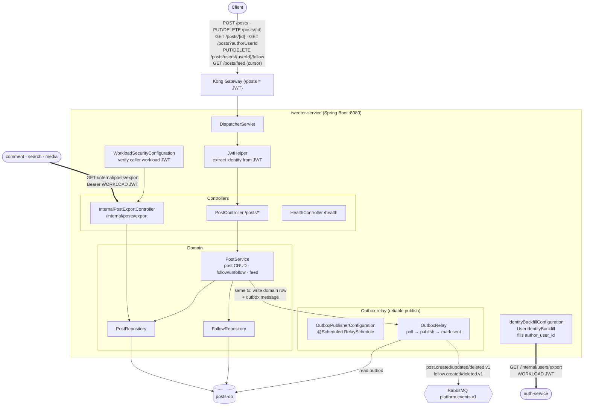

# tweeter-service — Architecture

Owns the `/posts` prefix: **posts, follows, and the fan-out feed**. It is the source of
truth for post data and the **export origin** that comment / search / media backfill from.
Owns `posts-db`. Uses the **transactional outbox** pattern to publish events reliably.

## Component / request flow

## Domain model

**`Post`** — `id`, `authorUsername` + `authorUserId` (denormalized identity), `content` (≤280),
`createdAt` / `updatedAt`, `deletedAt` (**soft delete**), `version` (optimistic lock).

**`Follow`** — `id`, `followerUsername`/`followerUserId`, `followeeUsername`/`followeeUserId`, `createdAt`.

## Responsibilities & contracts

- **Posts API (`/posts`)** — create, read, update, soft-delete (sets `deletedAt`), list by author, and a **cursor-paginated feed** built from the follow graph.
- **Follow graph** — `PUT/DELETE /posts/users/{userId}/follow` maintain `Follow` rows that drive the feed.
- **Export origin (`/internal/posts/export`)** — workload-JWT-guarded post snapshot; comment / search / media pull from here to backfill their own projections.
- **Events published (via outbox)** — `post.created/updated/deleted.v1`, `follow.created/deleted.v1`.

## Notable design choices

- **Transactional outbox** — `PostService` writes the domain row *and* an outbox message in one DB transaction; a scheduled `OutboxRelay` polls unsent rows and publishes to RabbitMQ, then marks them sent. Guarantees at-least-once delivery with no dual-write race between DB and broker.
- **Denormalized author identity** — each post/follow stores both username and `authorUserId` (UUID) so reads never need a synchronous call to auth-service.
- **Identity backfill** — `IdentityBackfillConfiguration` pulls `auth-service`'s `/internal/users/export` (as a workload-JWT *client*) to fill `author_user_id` where historically null — the mirror image of tweeter's own export role.
- **Soft delete** — `deletedAt` preserves history and lets the `post.deleted.v1` event drive downstream cleanup (search index, comments, media).
