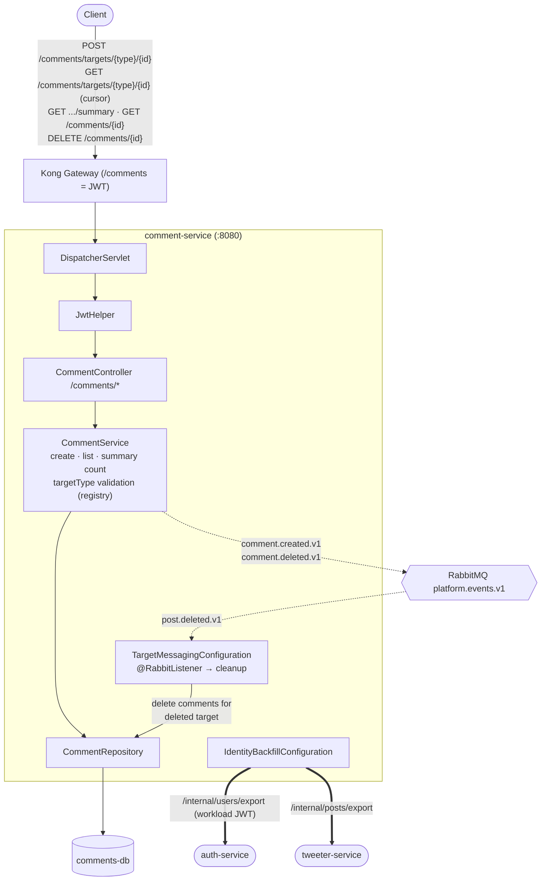

# comment-service — Architecture

Owns the `/comments` prefix: **reusable comments attached to any target reference**
(`{targetType}/{targetId}`), not just posts. Owns `comments-db`. Consumes `post.deleted`
to clean up, and backfills identity from auth.

## Component / request flow

## Domain model — `Comment`

`id`, `targetType`, `targetId` (generic reference), `authorUsername` + `authorUserId`,
`content`, `createdAt`. Comments are keyed by `(targetType, targetId)` so the same service
serves posts, media, or any future entity.

## Responsibilities & contracts

- **Generic target comments** — `targetType` is validated against a shared `TargetTypeRegistry`; `targetId` is opaque. This is what makes the service reusable across owning services.
- **Reads** — cursor-paginated comment list per target, plus a lightweight `/summary` count endpoint (used by the BFF).
- **Events published** — `comment.created.v1`, `comment.deleted.v1`.
- **Events consumed** — `post.deleted.v1`: when a post is deleted upstream, `TargetMessagingConfiguration`'s listener removes the orphaned comments for that target.
- **Identity backfill** — pulls auth (`/internal/users/export`) and tweeter (`/internal/posts/export`) with a workload JWT to reconcile denormalized identity.

## Notable design choices

- **Reference-based reuse over foreign keys** — decoupling by `(targetType, targetId)` means comment-service never imports another service's schema; the owning service just emits its type string.
- **Event-driven cleanup** — no synchronous cascade; deletion propagates via `post.deleted.v1`, keeping the write path fast and services independent.
