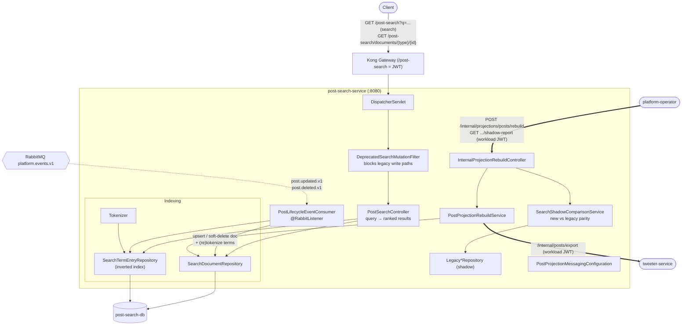

# post-search-service — Architecture

Owns the `/post-search` prefix: **keyword search over a manually-maintained inverted index**
of post snapshots. It is a pure **read model / projection** — it owns no source data, only a
searchable copy built by consuming post events. Owns `post-search-db`.

## Component / request flow

## Domain model

- **`SearchDocument`** — indexed post snapshot: `targetType`/`targetId`, author identity, `content`, `likeCount`, `indexedAt`, `aggregateVersion` (for idempotent ordering), `deletedAt` (tombstone).
- **`SearchTermEntry`** — `(term, documentId)` rows = the **inverted index** used for keyword lookup.
- **`LegacySearchDocument`** — old projection kept in parallel for **shadow comparison** during migration.

## Responsibilities & contracts

- **Search API** — tokenizes the query and looks up matching documents via `SearchTermEntry`, returning ranked results; per-target document lookup too.
- **Projection maintenance** — `PostLifecycleEventConsumer` consumes `post.updated.v1` / `post.deleted.v1`, upserts or tombstones the `SearchDocument`, and rebuilds its term entries via `Tokenizer`.
- **Rebuild / reconcile** — `/internal/projections/posts/rebuild` re-pulls tweeter's export to rebuild the index from scratch; `shadow-report` compares new vs legacy for parity.

## Notable design choices

- **Manual inverted index** — `SearchTermEntry` is a hand-rolled term→document table (no Elasticsearch), showing the mechanics of search inside plain Postgres.
- **Idempotent projection via `aggregateVersion`** — out-of-order or duplicate events don't corrupt the index; older versions are ignored.
- **Shadow migration** — `DeprecatedSearchMutationFilter` + `SearchShadowComparisonService` let a new projection run alongside the legacy one and be verified before cutover.
- **CQRS read side** — this service is purely a queryable projection; all writes come from events, never from clients.
