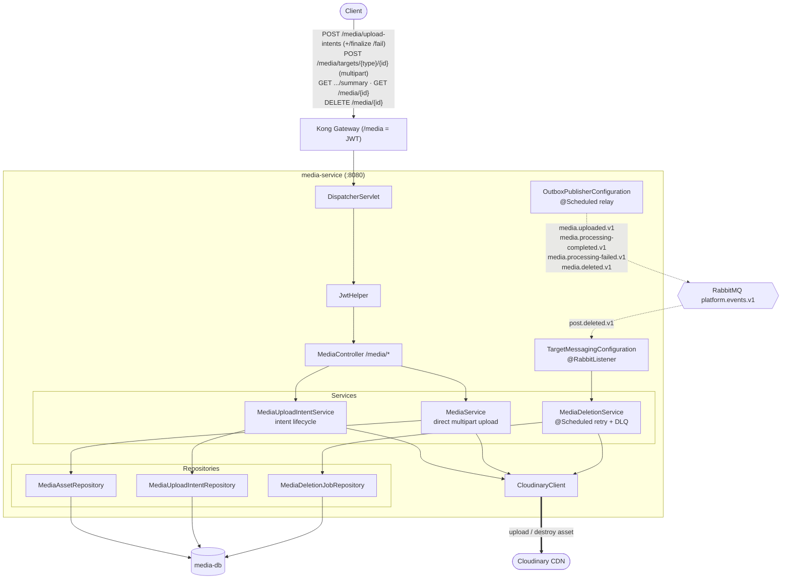

# media-service — Architecture

Owns the `/media` prefix: **reusable image/video attachments** backed by Cloudinary, attached
to any target reference. Owns `media-db`. Uses an **upload-intent** state machine, the
**transactional outbox** for events, and a **retry/DLQ deletion job** for external cleanup.

## Component / request flow

## Domain model

- **`MediaUploadIntent`** — the upload state machine (`@Enumerated Status`): owner identity, target ref, `idempotencyKey`, `resourceType`/`format`, `maxBytes`, reserved `publicId`, `expiresAt`, resulting `mediaAssetId`.
- **`MediaAsset`** — finalized asset: target ref, uploader identity, Cloudinary `publicId`/`secureUrl`/`thumbnailUrl`, `resourceType`, `format`, `bytes`, `width`/height.
- **`MediaDeletionJob`** — async external-delete job: `publicId`, `attempts`, `nextAttemptAt`, `completedAt`, `deadLetteredAt`, `lastError`.

## Responsibilities & contracts

- **Two upload paths** — (1) **intent-based**: reserve intent → client uploads → `finalize`/`fail`; (2) **direct multipart** POST. Both enforce size/format limits and write a `MediaAsset`.
- **Events published (outbox)** — `media.uploaded/processing-completed/processing-failed/deleted.v1`.
- **Events consumed** — `post.deleted.v1`: enqueue deletion jobs for that target's assets.
- **Reliable external deletion** — `MediaDeletionService` scheduler works `MediaDeletionJob` rows with backoff (`nextAttemptAt`), dead-letters after repeated failure, guaranteeing Cloudinary cleanup even if the API is temporarily down.

## Notable design choices

- **Idempotent uploads** — `idempotencyKey` on the intent prevents duplicate assets from retried client uploads.
- **Outbox for events + job table for side effects** — DB is the source of truth for both event emission and pending Cloudinary deletes; nothing is lost if the process crashes mid-operation.
- **State machine over booleans** — the intent `Status` enum makes the reserve→finalize/fail/expire lifecycle explicit and auditable.
