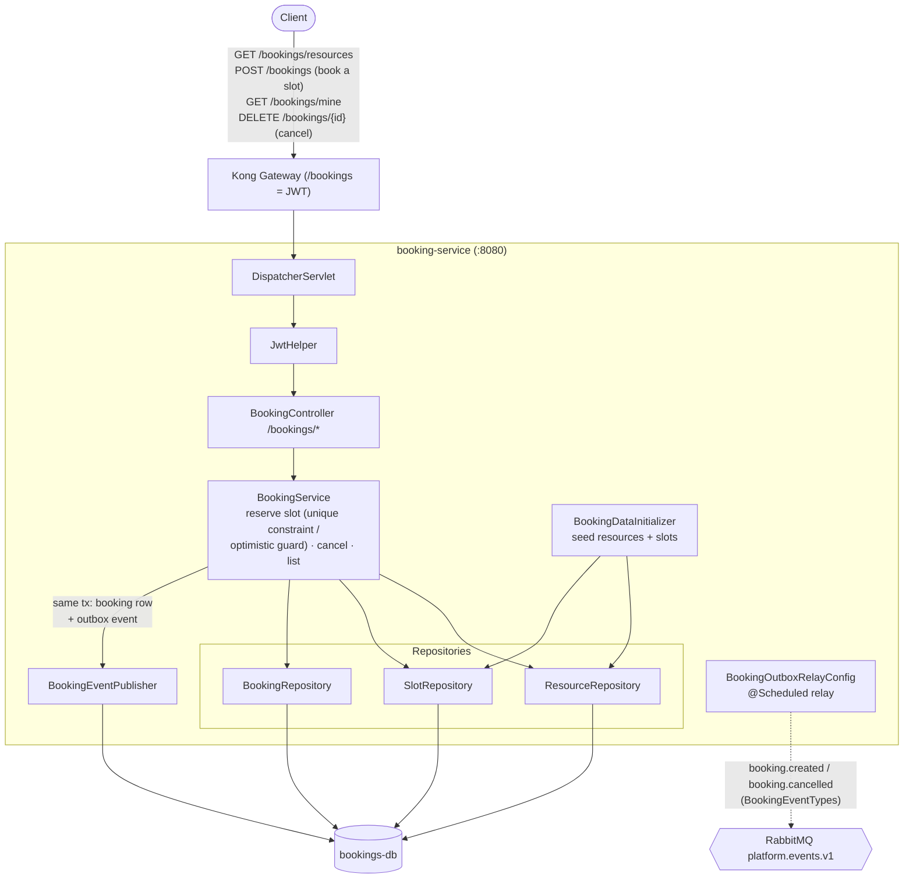

# booking-service — Architecture

Owns the `/bookings` prefix: **generic resource + time-slot booking** with a
**no-double-booking guarantee**. Works for any bookable resource (rooms, turf, equipment).
Owns `bookings-db`. Publishes booking events via an outbox; consumes nothing.

## Component / request flow

## Domain model

- **`Resource`** — bookable thing: `name`, `location`, `createdAt`.
- **`Slot`** — a bookable window on a resource: `resourceId`, `startTime`, `endTime`.
- **`Booking`** — `slotId`, booker identity (`username`/`userId`), `status`, `createdAt`, `cancelledAt`.

## Responsibilities & contracts

- **Browse & book** — list resources/slots, book a slot, list "my" bookings, cancel a booking.
- **No double booking** — a slot can be held by at most one active booking, enforced at the DB layer (unique constraint on `slotId` for active bookings) so concurrent requests can't both win.
- **Events published (outbox)** — `booking.created` / `booking.cancelled` via `BookingEventPublisher` + scheduled relay.

## Notable design choices

- **Standalone service** — depends only on its own DB + user JWT; no synchronous calls to other services and no inbound events. A clean example of the minimal plug-kit shape.
- **Concurrency correctness at the database** — the double-booking rule is a persistence-level invariant, not application-level checking, so it holds under race conditions.
- **Generic resource model** — `Resource`/`Slot` are domain-neutral, making the same service reusable across any slot-based booking scenario.
- **Outbox for events** — booking lifecycle is broadcast reliably for any future consumer (notifications, analytics) without coupling.
