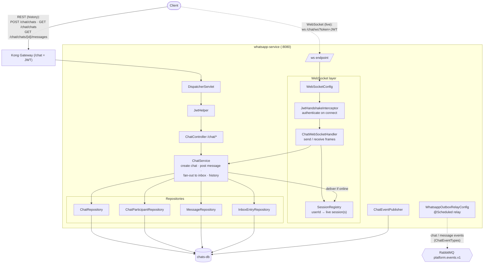

# whatsapp-service — Architecture

Owns the `/chat` prefix: **WhatsApp-style chat** = REST for history + **WebSocket for
real-time delivery**. Owns `chats-db`. Uses an **inbox/outbox** model so messages are durable
and deliverable even when a recipient is offline.

## Component / request flow

## Domain model

- **`Chat`** — conversation: `name`, `createdAt`.
- **`ChatParticipant`** — membership: `chatId`, `username`/`userId`.
- **`Message`** — `chatId`, sender identity, `content`, `createdAt`.
- **`InboxEntry`** — per-recipient delivery record: `messageId`, `recipientUserId`, `delivered` flag, `deliveredAt` — the durable "unread/undelivered" queue.

## Responsibilities & contracts

- **REST history** — create chats, list my chats, page a chat's messages.
- **Real-time delivery** — clients open a WebSocket authenticated by JWT at handshake (`JwtHandshakeInterceptor`); `SessionRegistry` maps online users to sessions; `ChatWebSocketHandler` pushes new messages live.
- **Store-and-forward** — every message writes an `InboxEntry` per recipient; online recipients get an immediate push and the entry is marked `delivered`, offline ones pick it up later.

## Notable design choices

- **Two transports, one service** — REST for durable history, WebSocket for low-latency push; both share the same `ChatService` write path.
- **Inbox pattern for offline delivery** — persistence-first means no message is lost if a recipient is disconnected; delivery is a state transition on `InboxEntry`, not a fire-and-forget socket write.
- **JWT at handshake** — auth happens once on connect (query-token), so per-frame auth isn't needed and unauthenticated sockets never open.
- **Standalone-ish** — self-contained chat domain; emits events via outbox for any future integration but consumes none.
