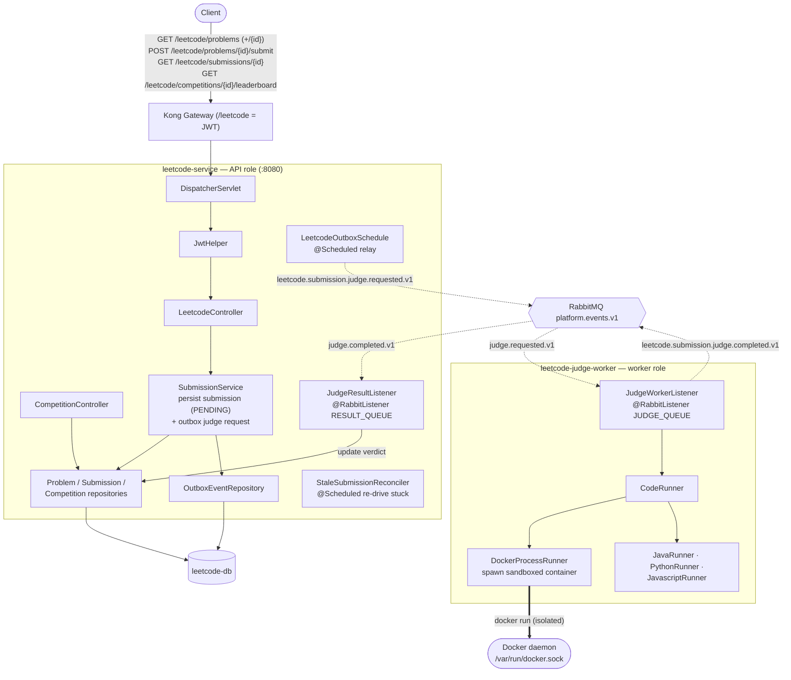

# leetcode-service — Architecture

Owns the `/leetcode` prefix: **coding problems, submissions, competitions, and sandboxed code
execution**. Deployed as **two roles from one image** — an API (`LEETCODE_ROLE=api`) and a
**judge worker** (`LEETCODE_ROLE=worker`) that runs untrusted code in throwaway Docker
containers. They communicate over RabbitMQ. Owns `leetcode-db`.

## Component / request flow

## Domain model

- **`Problem`** — problem statement + test cases.
- **`Submission`** — `problemId`, submitter identity, `code`, `language`, `status` (PENDING → ACCEPTED / WRONG_ANSWER / TIME_LIMIT_EXCEEDED / RUNTIME_ERROR / COMPILE_ERROR), `passedCount`/`totalCount`, `executionTimeMs`, `errorMessage`, `competitionId`.
- **`Competition` / `CompetitionProblem`** — timed contests with a leaderboard.
- **`OutboxEvent`** — outbox rows for reliable judge-request emission.

## Responsibilities & contracts

- **API role** — list/read problems, accept submissions (persist `PENDING` + enqueue a judge request via outbox), read submission status, competition leaderboards.
- **Worker role** — consumes `judge.requested.v1`, runs the code per-language in an **isolated Docker container** via `DockerProcessRunner`, and publishes `judge.completed.v1` with the verdict.
- **Result handling** — API's `JudgeResultListener` consumes `judge.completed.v1` and updates the submission's verdict/counts.

## Notable design choices

- **Single image, two roles** — API and worker share code and DB but scale independently; `LEETCODE_ROLE` selects behavior.
- **Async judging via RabbitMQ** — submission returns immediately (`PENDING`); heavy, risky execution is offloaded so the API stays responsive.
- **Sandboxed execution** — untrusted user code runs in ephemeral Docker containers (worker mounts the Docker socket), isolating it from the host and other submissions.
- **Reliability nets** — outbox for judge requests + `StaleSubmissionReconciler` to re-drive submissions stuck in PENDING (lost/failed judge runs).
