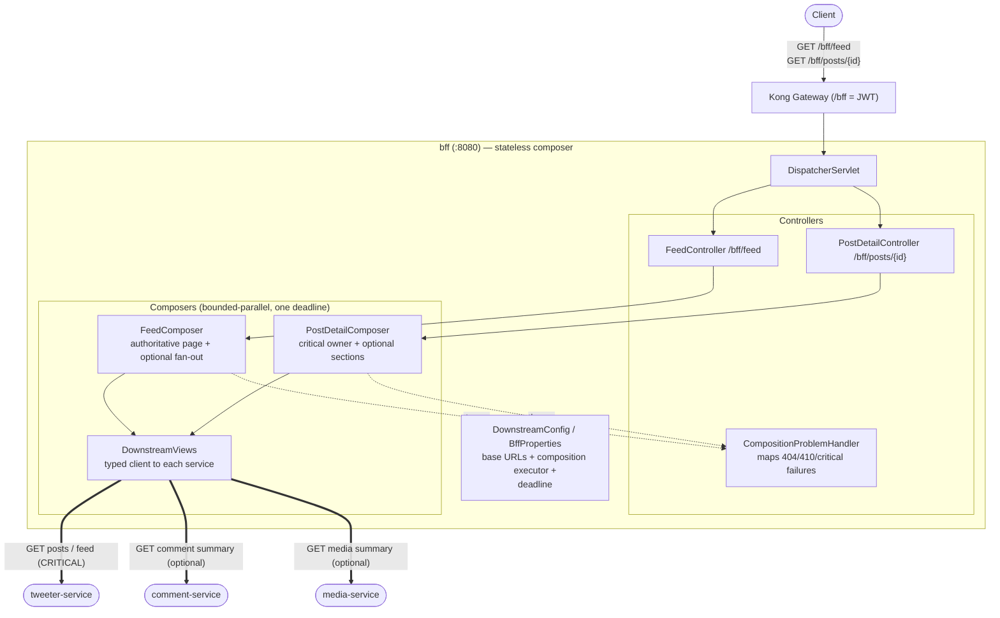
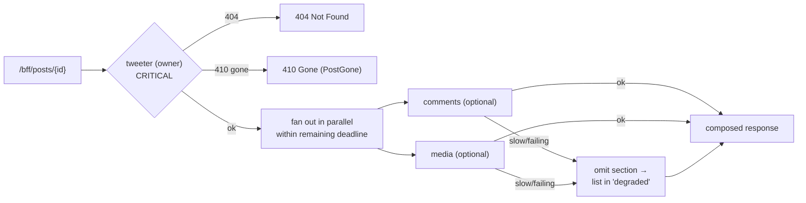

# bff — Architecture (Backend-for-Frontend / API composer)

Owns the `/bff` prefix: **client-shaped read composition** across owning services. It holds
**no database and no source of truth** — it fans out to tweeter / comment / media, stitches
their responses into one client-friendly payload, and enforces **strict deadlines with
partial (degraded) responses**.

## Component / request flow

## Composition semantics

## Responsibilities & contracts

- **`GET /bff/feed`** — fetch the authoritative cursor page from tweeter once, then fan out optional comment/media summaries on a bounded executor sharing **one page deadline** (avoids N serial timeouts multiplying latency).
- **`GET /bff/posts/{id}`** — the **owner (tweeter) is the critical dependency**: its 404 → 404, its 410 → `PostGone`. Comments and media are **optional**, fetched in bounded parallel; if slow or failing, the section is omitted and named in `degraded` rather than failing the whole response.
- **Error mapping** — `CompositionProblemHandler` translates `PostNotFoundException` / `PostGoneException` / `CriticalDependencyException` into proper HTTP status.

## Notable design choices

- **No DB, no ownership** — the BFF never persists or owns data; it strictly composes reads from owning services, preserving database-per-service boundaries.
- **Critical vs optional dependencies** — an explicit contract: only the owning service can fail the request; enrichment degrades gracefully.
- **One shared deadline + bounded parallelism** — every optional call shares a single budget on a bounded executor, so one slow dependency can't multiply tail latency or exhaust threads.
- **Partial responses over hard failure** — clients get the best available view plus an honest `degraded` list, instead of an all-or-nothing 500.
