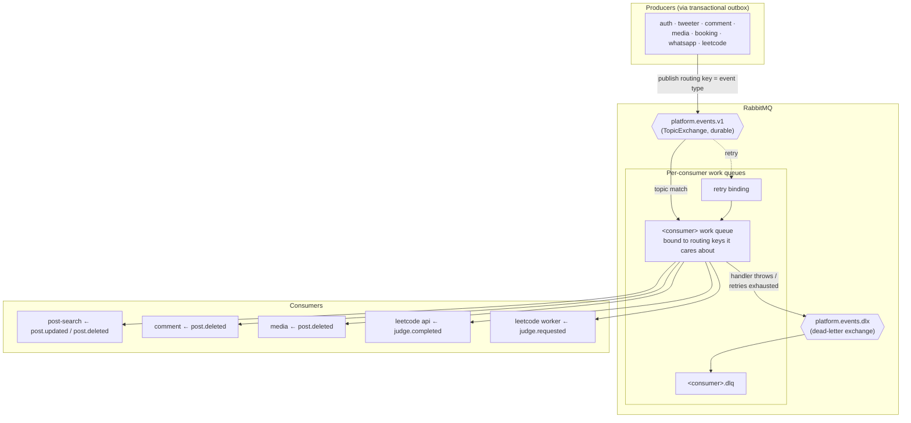
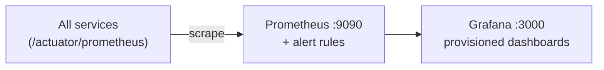

# Platform — Messaging Backbone & Observability

Cross-cutting infrastructure shared by every service. The `platform/` modules provide the
event **contracts** (`messaging-contracts`), the reusable **topology + outbox/verifier
support** (`messaging-support`), and the **observability** stack.

## Event backbone topology (RabbitMQ)

- **One topic exchange** `platform.events.v1`; routing key = the event type string (e.g. `post.deleted.v1`).
- **Per-consumer queue** binds only the routing keys it needs (`MessagingTopology` builds exchange + queue + bindings + DLQ).
- **Dead-letter path** — failed messages (after retry) route via `platform.events.dlx` to a `<consumer>.dlq` for inspection/replay; a `messaging.dlq.count` metric tracks them.

## Event catalog (`messaging-contracts` · `EventTypes`)

| Domain | Events | Produced by | Consumed by |
|--------|--------|-------------|-------------|
| user | `user.registered/profile-updated/deactivated.v1` | auth | (projections / backfill) |
| post | `post.created/updated/deleted.v1`, `post.like-count-changed.v1` | tweeter | post-search, comment, media |
| follow | `follow.created/deleted.v1` | tweeter | — |
| comment | `comment.created/deleted.v1` | comment | — |
| media | `media.uploaded/processing-completed/processing-failed/deleted.v1` | media | — |
| leetcode | `leetcode.submission.judge.requested.v1`, `...judge.completed.v1` | leetcode api / worker | worker / api |

All events are wrapped in a shared **`EventEnvelope`** (type, id, timestamp, payload). Schemas
are versioned (`.v1`) and guarded by contract tests (`SchemaCompatibilityTest`,
`SchemaValidationTest`) so producers and consumers evolve safely.

## `messaging-support` (shared library)

- **`MessagingTopology`** — declares the topic exchange, DLX, and per-consumer queue/binding/DLQ sets.
- **Transactional outbox** — `OutboxRelay` + `RelaySchedule`: services persist an outbox row in the same DB transaction as the domain change; a scheduled relay publishes and marks sent (at-least-once, no dual-write race). Used by tweeter, media, booking, whatsapp, leetcode.
- **Workload identity** — `WorkloadJwtIssuer` / `WorkloadJwtVerifier`: mint & verify short-lived service-to-service JWTs (trusted-caller list, small clock skew) for `/internal/*` export endpoints.

## Observability

- **Prometheus** scrapes each service's metrics endpoint; rule files under `observability/prometheus/rules`.
- **Grafana** with provisioned dashboards + datasource, admin credentials via env.
- Enabled with the `observability` compose profile; DLQ depth (`messaging.dlq.count`) and standard app/JVM metrics feed the dashboards.

## Deployment model (docker-compose profiles)

Everything runs in Docker on one `kong-net` bridge network. **Compose profiles** turn services
on à la carte — `auth`, `tweeter`, `comments`, `post-search`, `media`, `booking`, `chat`,
`leetcode`, `bff`, `observability`. `rabbitmq` joins whenever any event-driven profile is up;
`users-db` + `auth-service` come up for every app profile (shared identity). Each service is
registered at the gateway by its **plug kit** (`plug/kong-setup.sh`) and the matching
`kong/setup-*.sh`.
