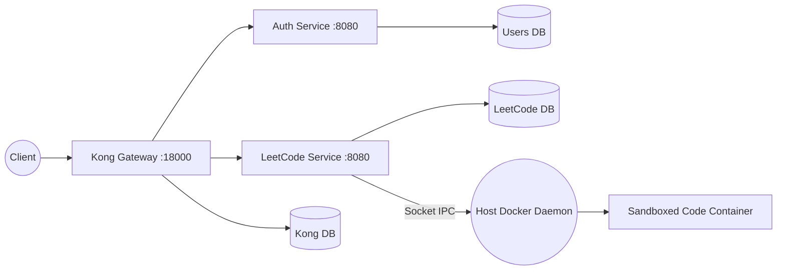

# Architecture and Execution Flow

This document explains how Kong, `auth-service`, and `leetcode-service` interact, detailing the execution path for submitting code and querying leaderboards.

## High-Level Architecture

The `leetcode-service` is responsible for handling programming problems, running user code securely, and calculating competition rankings. 

## Service Boundary

The LeetCode service owns:
- Problem definitions (code stubs, hidden test cases)
- Submission logs and status updates
- Container execution lifecycle (via Docker Daemon socket)
- Competition logic and leaderboards

It does not own:
- User identities, profile data, or passwords (handled by `auth-service`)
- Payment processing or social networking layers

## Request Execution Flow: `POST /leetcode/problems/{id}/submit`

1. **Client to Kong**
   The client makes a POST request to `/leetcode/problems/two-sum/submit` containing a `SubmitRequest` payload with the user's `code` and `language`.

2. **Kong JWT Plugin & Rate Limiting**
   Kong validates the token signature against the secret provisioned by `auth-service`. It also enforces a strict rate limit for LeetCode submissions to prevent malicious server overwhelming.

3. **Routing to Upstream**
   Kong forwards the valid request to `leetcode-service` on its internal network.

4. **Spring MVC Controller**
   `LeetcodeController.submitCode()` reads the JWT payload `sub` using `JwtHelper` to identify the user.

5. **Sandbox Wrapper Generation**
   Based on the chosen language, the application identifies a `CodeRunner` (e.g., `PythonRunner`). The runner fetches the hidden test cases from `leetcode-db` and wraps the user's code within a language-specific test harness.

6. **Dynamic Container Execution**
   `DockerProcessRunner` executes a transient sibling container (e.g., `python:3.11-alpine`) using Java's `ProcessBuilder` configured to communicate with the host's `/var/run/docker.sock`. 
   - **Isolation:** The container is restricted with `--network none`, `--cpus=0.5`, and `-m 128m`.
   - **Data IPC:** The test wrapper is piped directly to the container's standard input. No filesystem mounts are used for user code.
   - **Timeout Enforcement:** The Java service forcefully destroys the process if it runs for over 5 seconds.

7. **Result Parsing and Persistence**
   The Java service captures standard output, parses the JSON results produced by the test harness, and calculates the overall execution status (e.g., `ACCEPTED`, `WRONG_ANSWER`). It writes the `Submission` row to PostgreSQL.

8. **Response**
   The client receives a full JSON summary of their code's performance.

## Leaderboard Flow

1. Client requests `GET /leetcode/competitions/{id}/leaderboard`.
2. Controller triggers `SubmissionRepository.getLeaderboard()` containing an aggregate JPQL query.
3. Database groups correct submissions by user, counting unique problem IDs, and uses `MAX(submittedAt)` as the tie-breaker completion time.
4. The service translates the database projection into an ordered, paginated list of `LeaderboardRow` objects.
