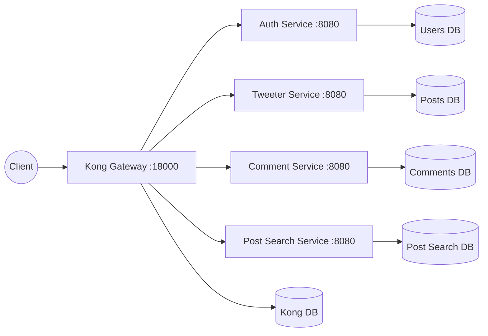
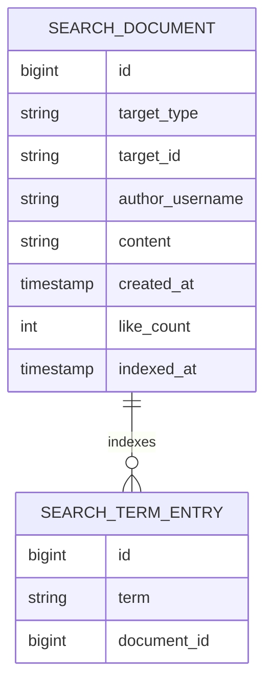

# Architecture and Execution Flow

This document explains how Kong, `auth-service`, `tweeter-service`,
`comment-service`, and `post-search-service` compose to provide searchable
posts without coupling the search service to the post service.

## High-Level Architecture



`post-search-service` owns a searchable snapshot of post-like documents. It
does not read `posts-db`, call `tweeter-service`, or call `comment-service`.
The composed product creates a post, then explicitly indexes that post into
search using a stable target reference such as:

```text
targetType = tweeter.post
targetId   = 123
```

This keeps the search service reusable. A future YouTube-style service could
index `youtube.video/{id}` or `youtube.post/{id}` without changing the search
database schema.

## Service Boundary

The post-search service owns:

- searchable document snapshots
- normalized search terms
- manual inverted-index rows
- keyword search with AND semantics
- cursor paging for `recency` and `likes` sort orders
- stored `likeCount` ranking signal
- target key validation

It does not own:

- users, passwords, or sessions
- the source post record
- comment rows
- individual likes or reactions
- target existence validation
- Elasticsearch, Lucene, or Postgres full-text indexes

The post service remains the source of truth for posts. Search is allowed to
be stale until the composed product re-indexes a document.

## Boot Sequence: Who Calls Whom?

1. **Docker Compose (`docker-compose.yml`)**
   The `post-search` profile starts Kong, Kong's database, `auth-service`,
   `users-db`, `post-search-service`, and `post-search-db`.

2. **Core Gateway Configuration (`kong/setup-core.sh`)**
   This registers `/auth`, creates the Kong consumer `springboot-auth`, and
   creates or updates the HS256 JWT credential that matches tokens issued by
   `auth-service`.

3. **Search Plug Kit Configuration (`post-search-service/plug/kong-setup.sh`)**
   This creates the `post-search-service` upstream, registers the
   `/post-search` route, attaches Kong's `jwt` plugin, and applies rate
   limiting.

4. **Standalone Composition Demo**
   `examples/post-search-standalone/` composes auth, tweeter, comments, and
   search. Its smoke test creates posts, comments on one post, indexes post
   snapshots, updates like counts, and searches through Kong.

## Data Model



Important constraints and indexes:

- `search_documents` has a unique `(target_type, target_id)` constraint so
  ingestion is idempotent.
- `search_term_entries` has a unique `(term, document_id)` constraint so each
  normalized term appears once per document.
- `(term, document_id)` supports finding candidate documents by keyword.
- `(created_at DESC, id DESC)` supports recency sort paging.
- `(like_count DESC, created_at DESC, id DESC)` supports likes sort paging.

## Ingestion Flow: `PUT /post-search/documents/{targetType}/{targetId}`

1. **Client to Kong**
   The composed app sends a protected request:

   ```text
   PUT http://localhost:18000/post-search/documents/tweeter.post/123
   Authorization: Bearer <token>
   Content-Type: application/json
   ```

   Body:

   ```json
   {
     "authorUsername": "alice",
     "content": "java spring post search",
     "createdAt": "2026-07-09T00:00:00Z"
   }
   ```

2. **Kong JWT Plugin**
   Kong verifies the token signature and expiration before Java receives the
   request.

3. **Spring MVC Controller**
   `PostSearchController.upsertDocument()` extracts the JWT `sub` only to
   require an authenticated caller. The document author still comes from the
   indexed snapshot body, because search stores source metadata.

4. **Business Logic**
   `PostSearchService.upsertDocument()` validates:

   - target type and id format
   - author username
   - content is non-empty and at most 2000 characters
   - createdAt is present
   - content contains at least one searchable term

5. **Tokenization**
   `Tokenizer` lowercases content, splits on non-alphanumeric characters, and
   deduplicates terms per document.

6. **Persistence**
   The service upserts the `SearchDocument`, deletes old term rows for that
   document, and writes the new `SearchTermEntry` rows.

7. **Response**
   The controller returns the stored document snapshot with its `indexedAt`
   timestamp.

## Search Flow: `GET /post-search?q=java spring&sort=recency`

1. Kong validates the JWT and rate limit.
2. `PostSearchController.search()` delegates to `PostSearchService.search()`.
3. The query text is normalized through the same tokenizer as ingestion.
4. Blank queries return `400`.
5. Multi-term queries use AND semantics:

   ```text
   q=java spring
   ```

   returns only documents that contain both `java` and `spring`.

6. `SearchDocumentRepository` finds matching document ids from term rows and
   returns document snapshots in the requested sort order.
7. The response shape is:

   ```json
   {
     "items": [],
     "nextCursor": null
   }
   ```

## Cursor Strategy

`recency` sort uses this order:

```text
createdAt DESC, id DESC
```

Its cursor stores:

```text
recency|createdAt|id
```

`likes` sort uses this order:

```text
likeCount DESC, createdAt DESC, id DESC
```

Its cursor stores:

```text
likes|likeCount|createdAt|id
```

The id tie-breaker matters because two documents can have the same timestamp
or like count. The cursor creates a stable total order so pages do not skip or
duplicate documents.

## Like Count Update Flow

`PUT /post-search/documents/{targetType}/{targetId}/like-count` updates only
the stored ranking signal:

```json
{
  "likeCount": 42
}
```

Rules:

- Missing document returns `404`.
- Negative count returns `400`.
- Updating likes does not change document terms.
- Search does not own individual likes; it only stores the current count.

## Final Composition Flow

The final demo proves the complete user-facing path:

1. Register and login through `/auth`.
2. Create posts through `/posts`.
3. Comment on `tweeter.post/{postId}` through `/comments`.
4. Index post snapshots through `/post-search`.
5. Update like counts in `/post-search`.
6. Search by keyword with `sort=recency`.
7. Search by keyword with `sort=likes`.

That flow demonstrates composition at the gateway and app layer, with zero
service-to-service calls and zero shared databases.
