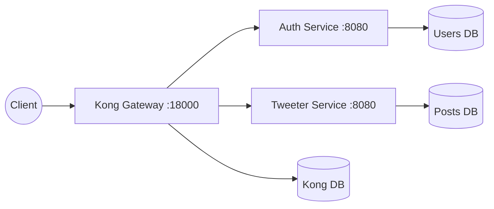

# Architecture and Execution Flow

This document explains how Kong, `auth-service`, and `tweeter-service`
interact, including the execution path for protected `/posts` requests.

## High-Level Architecture

The `tweeter-service` is decoupled from auth. It does not store passwords, user
profiles, or sessions. It stores only usernames from the JWT `sub` claim as
identity references.

## Boot Sequence: Who Calls Whom?

1. **Docker Compose (`docker-compose.yml`)**
   The `tweeter` profile starts Kong, Kong's Postgres database,
   `auth-service`, `users-db`, `tweeter-service`, and `posts-db`.

2. **Core Gateway Configuration (`kong/setup-core.sh`)**
   This registers `/auth`, creates the Kong consumer `springboot-auth`, and
   attaches the HS256 JWT credential that matches tokens issued by
   `auth-service`.

3. **Tweeter Plug Kit Configuration (`tweeter-service/plug/kong-setup.sh`)**
   This creates the `tweeter-service` upstream, registers the `/posts` route,
   attaches Kong's `jwt` plugin, and applies rate limiting.

4. **Smoke Test (`tweeter-service/plug/smoke.sh`)**
   This runs the two-user flow through Kong: register, login, follow, post,
   feed paging, and unfollow.

## Request Execution Flow: `POST /posts`

1. **Client to Kong**
   The client sends `POST http://localhost:18000/posts` with
   `Authorization: Bearer <token>`.

2. **Kong Router**
   Kong matches the `/posts` path to `tweeter-route`, which points to
   `tweeter-service`.

3. **Kong JWT Plugin**
   Kong validates the token signature and expiration using the credential
   registered for `springboot-auth`. If the token is missing, invalid, or
   expired, Kong returns `401` before the request reaches the service.

4. **Kong Rate Limiting**
   Kong checks the rate-limiting plugin. If the client exceeds the configured
   limit, Kong returns `429 Too Many Requests`.

5. **Kong to Upstream**
   Kong proxies the request through the Docker network to
   `http://tweeter-service:8080/posts`.

6. **Spring Boot Dispatcher**
   Embedded Tomcat receives the request. Spring's `DispatcherServlet` maps it
   to `PostController.create()` based on `@PostMapping`.

7. **Controller and Service Logic**
   `PostController` extracts the username from the already-verified JWT's
   `sub` claim using `JwtHelper`. It delegates to `PostService`, which trims
   and validates content, then stores a `Post` row in `posts-db`.

8. **Response**
   The controller returns `201 Created` with the post ID, author username,
   content, and timestamp. Kong relays that response to the client.

## Feed Execution Flow: `GET /posts/feed`

1. Kong validates the JWT at the edge.
2. `PostController.feed()` extracts the current username from `sub`.
3. `PostService.feed()` reads posts where the author is in the caller's
   followee list.
4. The query orders by `created_at DESC, id DESC`.
5. The composite cursor encodes the last row's `(createdAt, id)`, preventing
   duplicate or skipped rows when timestamps tie.
