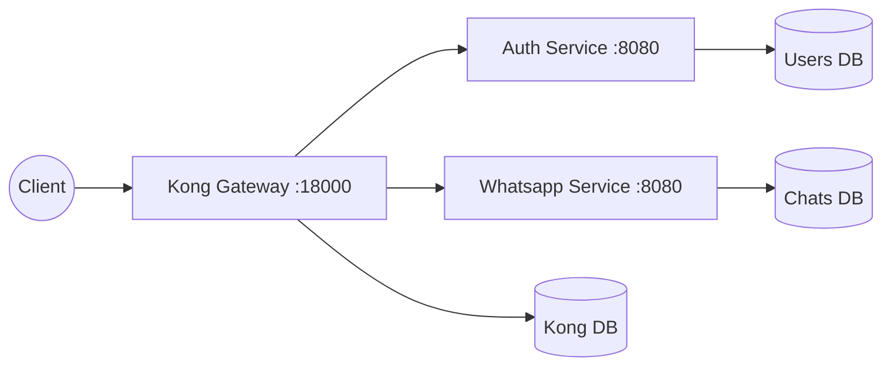
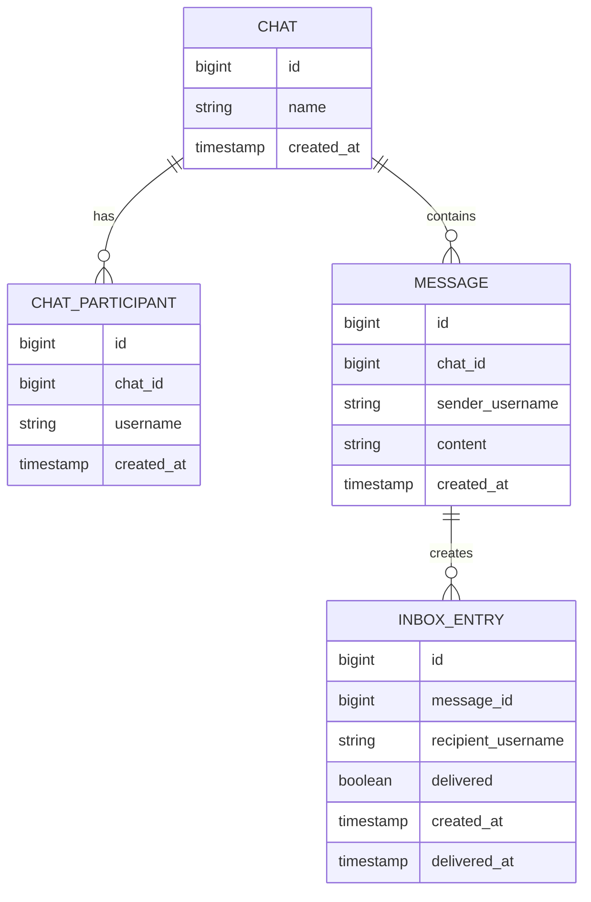

# Architecture and Execution Flow

This document explains how Kong, `auth-service`, and `whatsapp-service`
interact, including the exact path for REST requests, WebSocket upgrades,
realtime message delivery, offline replay, and ACK handling.

## High-Level Architecture



The `whatsapp-service` is decoupled from auth. It does not store passwords,
sessions, or user profiles. It stores usernames from the JWT `sub` claim as
identity references in chat participants, messages, and inbox entries.

## Service Boundary

The chat service owns:

- chat metadata
- chat membership
- durable message history
- per-recipient inbox rows for undelivered messages
- in-memory WebSocket session registry for the single running chat node

It does not own:

- passwords or login
- user profile records
- JWT signing or verification at the edge
- media upload
- multi-node routing or Redis Pub/Sub

That boundary keeps the service reusable. Any host project that has Kong and the
auth plug kit can mount chat by using `whatsapp-service/plug`.

## Boot Sequence: Who Calls Whom?

1. **Docker Compose (`docker-compose.yml`)**
   The `chat` profile starts Kong, Kong's Postgres database, `auth-service`,
   `users-db`, `whatsapp-service`, and `chats-db`.

2. **Core Gateway Configuration (`kong/setup-core.sh`)**
   This registers `/auth`, creates the Kong consumer `springboot-auth`, and
   attaches the HS256 JWT credential that matches tokens issued by
   `auth-service`.

3. **Chat Plug Kit Configuration (`whatsapp-service/plug/kong-setup.sh`)**
   This creates the `whatsapp-service` upstream, registers the `/chat` route,
   attaches Kong's `jwt` plugin, and applies rate limiting.

4. **Spring Boot Startup**
   `WhatsappApplication` starts embedded Tomcat and enables scheduling. JPA
   creates or updates the `chats`, `chat_participants`, `messages`, and
   `inbox_entries` tables in `chats-db`.

5. **WebSocket Registration**
   `WebSocketConfig` registers `ChatWebSocketHandler` at `/chat/ws` and attaches
   `JwtHandshakeInterceptor`.

## Data Model



Important constraints and indexes:

- `chat_participants` has a unique pair `(chat_id, username)`.
- `chat_participants.username` is indexed for "which chats am I in?"
- `inbox_entries` has a unique pair `(message_id, recipient_username)`.
- `inbox_entries(recipient_username, delivered)` supports reconnect replay.
- `messages(chat_id, created_at DESC)` supports history reads.

## REST Request Flow: `POST /chat/chats`

1. **Client to Kong**
   The client sends `POST http://localhost:18000/chat/chats` with
   `Authorization: Bearer <token>` and a JSON body:

   ```json
   {
     "name": "alice and bob",
     "participants": ["bob"]
   }
   ```

2. **Kong Router**
   Kong matches `/chat` to `chat-route`, which points to `whatsapp-service`.

3. **Kong JWT Plugin**
   Kong validates the token signature and expiration. If the token is missing,
   invalid, or expired, Kong returns `401` before the request reaches Java.

4. **Kong Rate Limiting**
   Kong applies the service-level rate limit. If the caller exceeds the limit,
   Kong returns `429 Too Many Requests`.

5. **Kong to Upstream**
   Kong proxies the request to `http://whatsapp-service:8080/chat/chats`.

6. **Spring MVC Controller**
   `ChatController.createChat()` receives the request. It decodes the already
   verified JWT payload to read `sub`, which becomes the creator username.

7. **Business Logic**
   `ChatService.createChat()`:

   - trims and validates usernames
   - automatically includes the creator
   - de-duplicates participants with `LinkedHashSet`
   - rejects chats with fewer than 2 or more than 100 participants
   - creates a `Chat`
   - creates one `ChatParticipant` row per participant

8. **Response**
   The controller returns `201 Created` with a `ChatView` containing ID, name,
   sorted participants, and creation time.

## History Flow: `GET /chat/chats/{id}/messages`

1. Kong verifies the JWT at the edge.
2. `ChatController.messages()` extracts the current username from the token.
3. `ChatService.findMessages()` calls `requireParticipant()`.
4. If the chat does not exist, the service returns `404`.
5. If the user is not a participant, the service returns `403`.
6. `MessageRepository` reads newest-first messages ordered by:

   ```sql
   ORDER BY created_at DESC, id DESC
   ```

7. If a cursor is provided, the repository fetches rows older than the cursor:

   ```sql
   created_at < :createdAt OR (created_at = :createdAt AND id < :id)
   ```

8. The response contains `items` and a `nextCursor` when there are older rows.

The cursor includes both `createdAt` and `id`, because timestamps can tie. The
pair creates a total order and prevents duplicated or skipped messages.

## WebSocket Upgrade Flow: `/chat/ws`

1. **Client to Kong**
   The client opens `ws://localhost:18000/chat/ws` and includes:

   ```text
   Authorization: Bearer <token>
   ```

2. **Kong JWT Plugin**
   Kong validates the JWT on the HTTP upgrade request. Invalid or missing tokens
   get `401`; the Java WebSocket handler never runs.

3. **Kong Proxies the Upgrade**
   A valid upgrade is proxied to `http://whatsapp-service:8080/chat/ws`.

4. **Handshake Interceptor**
   `JwtHandshakeInterceptor` reads the `Authorization` header and uses
   `JwtHelper` to decode `sub`. Because Kong already verified the token, the
   service only needs the username identity.

5. **Session Attribute**
   The interceptor stores the username in the WebSocket session attributes.

6. **Connection Established**
   `ChatWebSocketHandler.afterConnectionEstablished()` registers the session in
   `SessionRegistry` under that username, then immediately replays any
   undelivered messages from `inbox_entries`.

## Realtime Send Flow: `sendMessage`

Client sends:

```json
{
  "type": "sendMessage",
  "chatId": 1,
  "content": "hello"
}
```

Execution path:

1. `ChatWebSocketHandler.handleTextMessage()` parses the JSON payload.
2. It reads the username from the WebSocket session attributes.
3. It delegates to `ChatService.sendMessage()`.
4. `ChatService` verifies the sender is a participant in the chat.
5. It validates non-empty content and caps content at 2000 characters.
6. It persists the `Message` row first.
7. It creates one `InboxEntry` per recipient, excluding the sender.
8. It returns a `Delivery` object with the message and recipient usernames.
9. The WebSocket handler pushes `newMessage` to any connected recipient sessions.
10. The sender receives `messageSent`.

The important correctness rule is:

```text
persist Message + InboxEntry rows first, push second
```

If the push fails, the inbox row still exists. The recipient will receive the
message on reconnect.

## ACK Flow

Recipient sends:

```json
{
  "type": "ack",
  "messageId": 10
}
```

Execution path:

1. `ChatWebSocketHandler` parses the ACK event.
2. `ChatService.ack(username, messageId)` looks for an inbox row matching that
   message and recipient.
3. If the row exists and is not delivered, it marks:

   - `delivered = true`
   - `delivered_at = now`

4. If the row does not exist, the ACK is ignored.
5. The server replies with an `ack` event.

Ignoring unknown ACK IDs is intentional. ACK is idempotent, and the desired final
state is simply "this recipient has delivered this message."

## Offline Replay Flow

1. Bob disconnects.
2. Alice sends messages to a chat containing Bob.
3. For each message, the service writes:

   - one durable `messages` row
   - one `inbox_entries` row for Bob with `delivered=false`

4. No live push happens because Bob has no open WebSocket session.
5. Bob reconnects.
6. `afterConnectionEstablished()` queries:

   ```text
   recipient_username = bob AND delivered = false
   ORDER BY created_at ASC, id ASC
   ```

7. The service sends each undelivered message as `newMessage`.
8. Bob ACKs each message.
9. The inbox rows are marked delivered.

This is an at-least-once delivery system. A crash after push but before ACK may
cause a duplicate replay later. Clients should deduplicate by `message.id`.

## Cleanup Flow

Postgres has no native TTL like DynamoDB, so the service uses a scheduled job:

```java
@Scheduled(cron = "0 0 0 * * *")
```

Every day, `ChatService.cleanupInbox()` deletes inbox rows that are:

- delivered, or
- older than 30 days

This keeps the inbox table from growing forever while preserving undelivered
messages long enough to satisfy the offline-delivery requirement.

## Why This Architecture Is Right-Sized

The interview-scale WhatsApp design eventually needs load balancers, consistent
hashing, Redis Pub/Sub, per-device inboxes, heartbeats, media storage, and
sequence-gap recovery. This project deliberately starts smaller:

- one chat node
- one in-memory `username -> sessions` map
- one Postgres database owned by chat
- no service-to-service calls
- no Redis until there is more than one chat node
- no per-device inbox until multi-device support exists

The durable delivery pattern is still the same as the large-scale design:

```text
persist first, push best-effort, replay until ACK
```

That is the transferable core of the system.

## Failure Behavior

| Situation | Behavior |
|-----------|----------|
| Missing JWT on REST request | Kong returns `401` |
| Missing JWT on WebSocket upgrade | Kong returns `401` |
| Non-participant reads history | Service returns `403` |
| Sender posts to a chat they are not in | WebSocket `error` event |
| Recipient offline | Message remains in inbox for replay |
| Push fails after persistence | Message replays later |
| Duplicate ACK | No harmful effect |
| Unknown ACK ID | Ignored |
| Token expires mid-socket | Socket remains open; token checked at upgrade |

## Standalone Proof

The integration proof lives in `examples/chat-standalone/`.

That demo starts a fresh Kong, auth service, users DB, chat service, and chats
DB. It then runs the same plug scripts and smoke test. Passing that demo proves
`whatsapp-service` can be reused in another host project without changing
service code.
